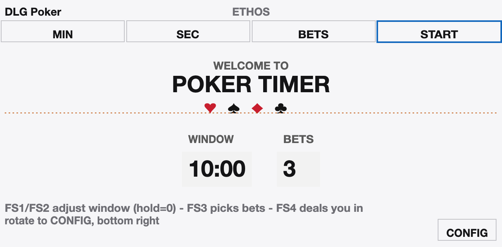
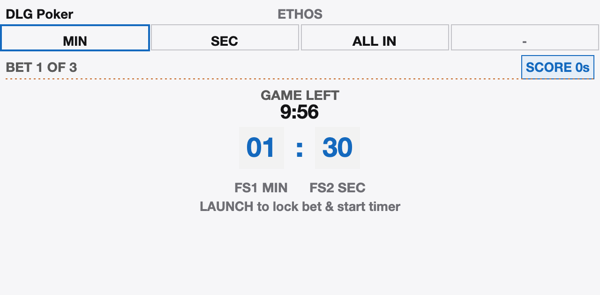
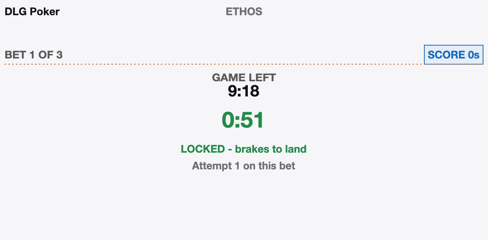
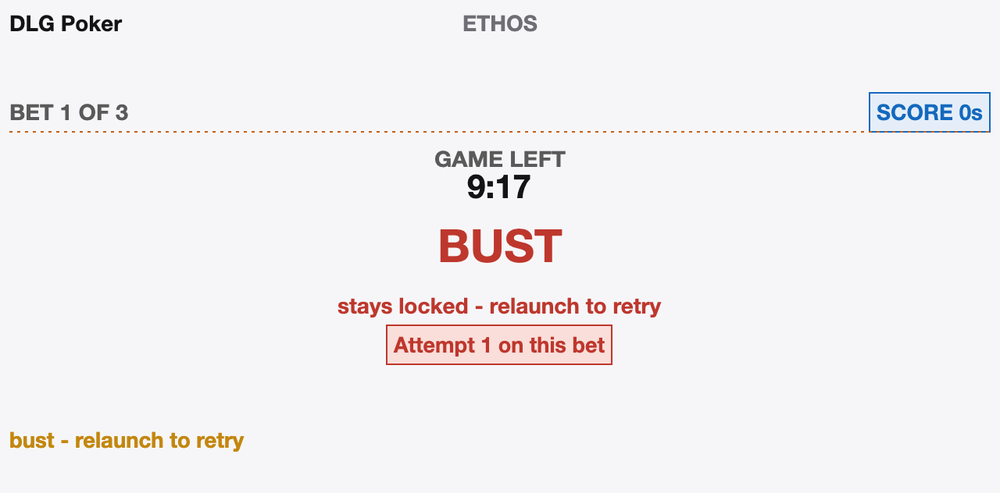
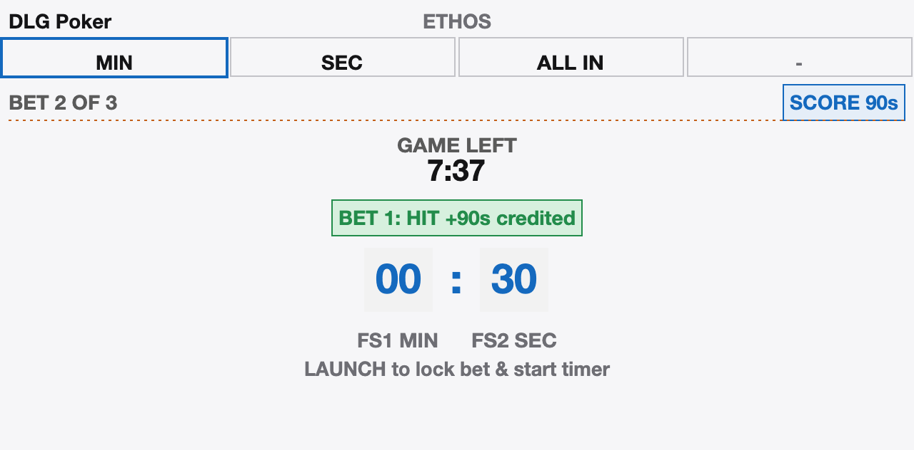
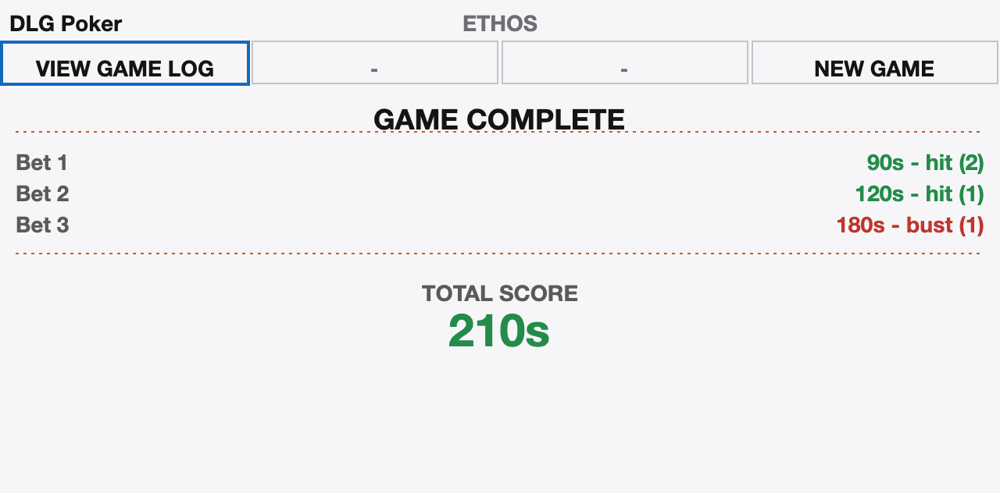
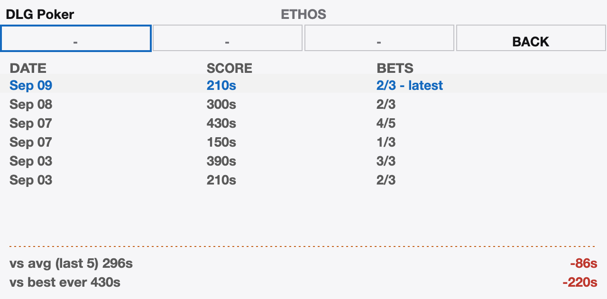
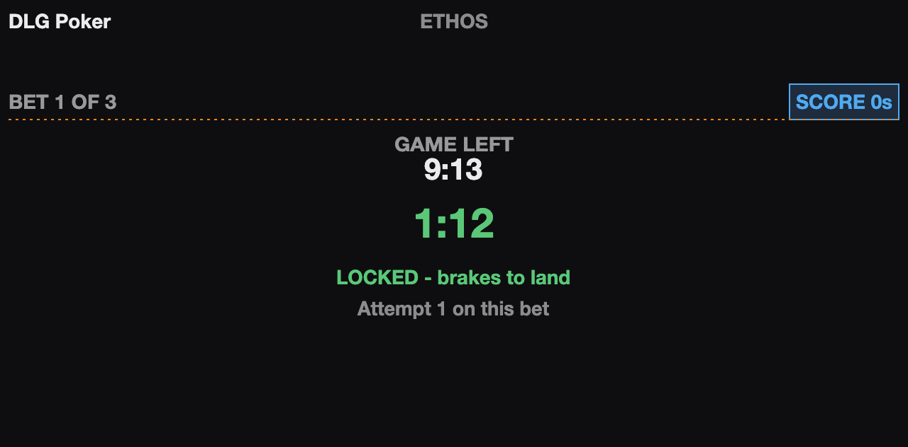
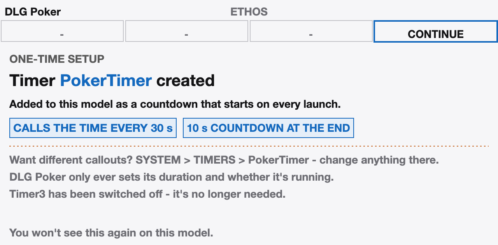

# DLG Poker

A practice tool for the F3K "Poker" task (Task E) on FrSky Ethos radios.
Built/field-tested on an X14.

Poker is a *time* game, not a height game: within a 10-minute working-time
window, the pilot commits to a target flight time before each launch, then
tries to land as close to (or past) that bet as possible. DLG Poker's job
is to drive the radio's own countdown timer with each bet at the right
moment and keep score — it doesn't add its own audio or invent a second
timekeeping system, since Ethos timers already do countdown beeps and
voice announcements well.

## Screens

<table>
  <tr>
    <td width="50%"><br><sub><b>Setup.</b> Pick the window and the number of bets, then START.</sub></td>
    <td width="50%"><br><sub><b>Place a bet.</b> Dial in MIN and SEC, then just throw. The launch locks the bet and starts the timer.</sub></td>
  </tr>
  <tr>
    <td><br><sub><b>In flight.</b> The bet counts down on the radio's own timer, with its voice callouts.</sub></td>
    <td><br><sub><b>Bust.</b> Landed early. The bet stays locked, and relaunching retries it.</sub></td>
  </tr>
  <tr>
    <td><br><sub><b>Hit.</b> The time is credited and the next bet is ready to edit, with no button press.</sub></td>
    <td><br><sub><b>Game complete.</b> Every bet's result, attempts in brackets, and the total score.</sub></td>
  </tr>
  <tr>
    <td><br><sub><b>Game log.</b> Recent games, measured against your average and your best.</sub></td>
    <td><br><sub><b>Night mode.</b> Same layout, dark palette.</sub></td>
  </tr>
  <tr>
    <td><br><sub><b>First run.</b> DLG Poker creates its own <code>PokerTimer</code> and tells you once.</sub></td>
    <td></td>
  </tr>
</table>

<sub>These images are produced by <a href="harness/render.py"><code>harness/render.py</code></a>, which plays a scripted game through the app's real game logic and drawing code at the X14's 640-pixel width. Layout, colours, text and game state are exactly what the radio draws. The typeface is the computer's, not the Ethos font, so letter shapes differ slightly from the real screen.</sub>

## How a game works

| Term | Meaning |
|---|---|
| Game | The 10-minute working-time window (configurable) |
| Bet | One announced target time |
| Hit | The bet's timer reached zero before landing |
| Bust | Landed before the timer reached zero — bet stays locked, try again |
| Retry | Re-launching to attempt the same locked bet again after a Bust |
| Score | Sum of the target times for every Hit this game |

1. Open the tool (System Tool, no widget) and set the window length and
   number of bets for the game, or just start with the configured
   defaults.
2. Press **START**. The game clock begins and the first bet is live.
3. Bump the bet up with **+SEC** (adds 10s, rolling into +1 min past 50s)
   or **+MIN** (adds 1 min). On a rotary/FS radio (e.g. X14), you can also
   scroll focus to MIN or SEC and press **ENTER** to edit it directly —
   scrolling then adjusts that field up *or* down (same 1 min / 10s steps),
   and ENTER again (or EXIT) leaves the field. On touch-capable radios
   (e.g. X20RS), tap the minutes or seconds value directly instead of
   scrolling to it — the tap does what ENTER does (tap again to leave),
   and from there the scroll wheel adjusts it up or down exactly like a
   non-touch radio. **Then just launch (throw it)** — releasing the glider
   is what locks in whatever time was showing *and* starts your target
   Ethos timer counting down, both at once. There's no separate confirm
   press; the screen says as much ("LAUNCH to lock bet & start timer")
   while you're still editing.
4. The radio's own configured countdown beeps/voice alerts count the bet
   down as normal; DLG Poker doesn't add anything to that.
5. Land. Landing is detected from a debounced Landing-mode/brake signal
   (an instant brake tap mid-flight is ignored) the moment you land:
   - Timer already reached zero → **Hit** — the bet's time is scored and
     the game immediately moves to the next bet's editing screen, showing
     "BET N: HIT +Ns credited" right alongside it. No extra button press.
   - Timer still counting → **Bust** — the bet stays locked, and
     launching again (**Retry**) restarts the same countdown with no
     extra button press needed. The Bust screen shows **"Attempt N on
     this bet"** — that count is per-bet, not a running total for the
     game: it resets to 0 the moment you move on to the next bet.
   - The launch switch gets held again before a landing was ever detected
     at all — without ever braking first? DLG Poker can't tell "genuinely
     landed and relaunching" from "still flying, switch touched on
     purpose" from the switch signal alone, so it treats the stranded
     attempt as resolved either way — but only once the switch has been
     held for **more than about a third of a second**. A quick accidental
     brush of the switch shorter than that is completely ignored —
     nothing changes at all, silent — so it's safe to fly with a hand
     near the switch without it costing you the attempt. What happens
     once the hold crosses that threshold depends on whether the timer
     had already reached zero at that moment:
     - **Still counting** (well before the target) → **Bust**, and the
       retry is immediate: the SAME target starts counting down again
       right away, no extra button press needed, no tone or vibration —
       same feel as a normal Bust-and-Retry above, just triggered by a
       relaunch instead of a real landing.
     - **Already at/past the target** → **Hit**. You flew for at least
       the full target duration, so relaunching instead of formally
       landing still counts — the bet's time is scored and the game
       moves on to the next bet's editing screen, showing "BET N: HIT
       +Ns credited" right alongside it, exactly like a normal Hit above.
       Gets an audible tone and a vibration, since this one really is
       worth looking up from the glider for — you're about to place a
       whole new bet on the very next throw.
6. **ALL IN** claims whatever time is left in the game window as your
   bet — computed at the moment you actually launch, not when you press
   the button. Unlike a normal bet, ALL IN still needs its own button
   press before you throw, since there's no edited time on screen for the
   throw itself to lock in.
7. After every bet in the game is resolved (or the window runs out), a
   summary shows each bet's result and the total score, logged for later
   review (recent games, best game, running average).
8. **RTN / EXIT ends the game.** Leave the tool at any point and the game
   is over: if you'd thrown at least once it's logged as it stands (bets
   you never got to are marked unresolved), a game with no throw in it is
   simply dropped, and the next time you open DLG Poker it starts fresh
   on the setup screen. The radio's timers are put back as they were.

## Settings

- **Game defaults** — working-time window length, bets per game.
- **Timer** — DLG Poker drives its own Ethos timer, **`PokerTimer`**,
  and sets it up for you. The first time you open the tool on a model
  that doesn't have one, it creates it — countdown, started and stopped
  by the app itself, with default callouts of **the remaining time every
  30 seconds and a spoken 10-second countdown at the end** — switches
  off the timer it used to drive (`Timer3`, if you had one), and shows a
  one-time screen saying so. Press CONTINUE and play. The timer is a
  normal model timer: open `SYSTEM > TIMERS > PokerTimer` to change the
  callouts (or anything else) to taste; DLG Poker only ever sets its
  duration and whether it's running, never the callouts. If you rename
  it, DLG Poker will create a fresh `PokerTimer` next time — so retype
  **Target timer** in Settings → Timer to the new name instead, or press
  **"Use PokerTimer again"** to rename it back. In the rare case the
  model has no free timer slot, DLG Poker asks you to pick one of the
  existing timers instead (that one's callouts are left alone), and
  remembers your choice. **Pause during a game** names a timer to pause
  for the length of a game and restore afterwards — by default the DLG
  template's `FlightTime` count-up, so it doesn't run alongside
  PokerTimer; leave it blank to turn that off.
- **Landing detection** — Lua-timed or native-logic-switch mode, which
  switch to watch, and a debounce threshold (1.0s by default) so a quick
  accidental brake tap mid-flight doesn't end a bet early.
- **Controls** — switch assignment for +MIN / +SEC / ALL IN /
  START-CANCEL-NEXT (defaults to the X14's Function Switches FS1–FS4), a
  hold-to-reset threshold, and a stuck-switch warning.
- **Display** — day or night mode.

## Installation

### Install with Ethos Suite

1. Prepare a ZIP file containing the final folder structure directly: the
   archive's top-level path should be `scripts/PokerTimer/...`, not
   wrapped in an extra parent folder.
2. In Ethos Suite, open the **Lua Library** tab.
3. Choose **Install lua script** and select the ZIP file.
4. Let Ethos Suite copy the script to the radio, then reboot — DLG Poker
   is a System Tool, so it appears in the System menu as "DLG Poker" (no
   widget/screen assignment needed).
5. Open it once to set the Timer/Landing detection/Controls options in
   Settings (see above) — the one-time `SYSTEM > TIMERS` step is required
   before it will actually count down.

ZIP structure for Ethos Suite:

```
scripts/
└── PokerTimer/
    ├── main.lua
    ├── core.lua
    ├── draw.lua
    ├── screen.lua
    ├── config.lua
    ├── pokertimer.png
    └── Files/
```

`Files/` must exist (even empty) because the tool stores its game log
there automatically as it runs.

### Install manually via the SD card or internal storage

Ethos radios can store scripts either on a removable SD card or in the
transmitter's internal storage — use whichever your radio is set up with.

1. Connect the radio to your computer and open its storage (SD card or
   internal storage, depending on your setup) in your file manager.
2. Copy the `PokerTimer` folder into the `scripts` folder there so the
   final script path is `scripts/PokerTimer/main.lua`.
3. Safely disconnect/eject and reboot the radio — Ethos scans scripts
   only at boot.
4. Open **System > Tools > DLG Poker** and configure the Timer, Landing
   detection, and Controls settings before your first game.

## Status

Field-tested on real X14 and X20RS transmitters, across multiple rounds
of pilot feedback on the actual gameplay flow (launch/landing detection,
scoring edge cases, touch interaction). Touch-capable radios (e.g. X20RS)
are fully supported — footer keys and the MIN/SEC/BETS values are
tappable directly (tapping a value enters the same scroll-to-adjust mode
ENTER gives non-touch radios); a tap acts on its release only, so the
two calls Ethos delivers per tap can never register as two presses. A
few known gaps are tracked in
[`CLAUDE.md`](./CLAUDE.md#known-open-items-as-of-last-session) (e.g.
X20RS hardware behavior for one timer API path is still unconfirmed, and
the log screen's per-game detail view isn't built yet). Version `1.0.1`.

## Development

See [`CLAUDE.md`](./CLAUDE.md) for architecture notes and the hard-won
Ethos-Lua findings this project ran into (timer API quirks, launch/landing
detection design, the required manual timer setup step) — read that before
touching `core.lua`. For the complete design rationale and every bench-test
result behind a given decision, see
[`DLG_Poker_Timer___Requirements_Specification.md`](./DLG_Poker_Timer___Requirements_Specification.md).
